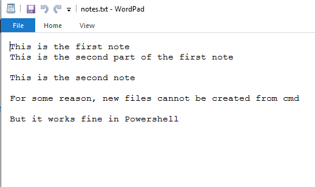

# Command Line Notes


This script is used to quickly take notes directly from the command prompt/powershell. It has been only tried on Windows.

Irony can be so painful! Command prompt on my pc isnt able to create files even in the C:\\ directory. Maybe because of some file structure...but anyways, this runs fine in powershell. Should i rename it so powershell notes? Maybe on the next update...

## Installation

command line notes requires:
- Python v3+ to run
- You know how you don't have to type .exe to execute a .exe file? That needs to be done for this python file as well. Add .pyw to PATHEXT environment variable (globally would be better). [More info on that here on Stack Overflow.](https://stackoverflow.com/questions/9037346/making-python-scripts-run-on-windows-without-specifying-py-extension)
- .pyw file should be associated with the pythonw.exe file in the python root directory (where python.exe and pythonw.exe lives). [Check out how to do it. Also, this explains why i used .pyw instead of the vanilla .py](https://docs.python.org/2/using/windows.html) If this seems too weird, just change the association at Control Panel\Programs\Default Programs\Set Associations
- ##### (OR) You can just use some [pyinstaller](https://www.pyinstaller.org) magic, install this as a .exe file and just add the .exe directory to the PATH environment variable. If you do this, then all those other scary sounding steps (like file type association and .pyw thingy) may not be necessary.
- Set the necessary path inside note.pyw where you want your notes.txt to be.

## Example code
This is in powershell:
```sh
PS C:\Users\User> note "This is the first note" "This is the second part of the first note"
PS C:\Users\User> note "This is the second note"
PS C:\Users\User> note "For some reason, new files cannot be created from cmd"
PS C:\Users\User> note "But it works fine in Powershell"
PS C:\Users\User>
```

#### The above code results in this notes.txt:


## Future plans
- Viewing the notes inside powershell
- Categorising notes using date
- Additional terminal arguements to delete notes, add a heading (which may be set as the filename)
- Restructuring notes so that instead of being stored in some notes.txt, they are stored in a folder organized by date or note heading
- ### Ultimate goal: A fully functional and intuitive note keeper through the terminal

License
----

MIT

